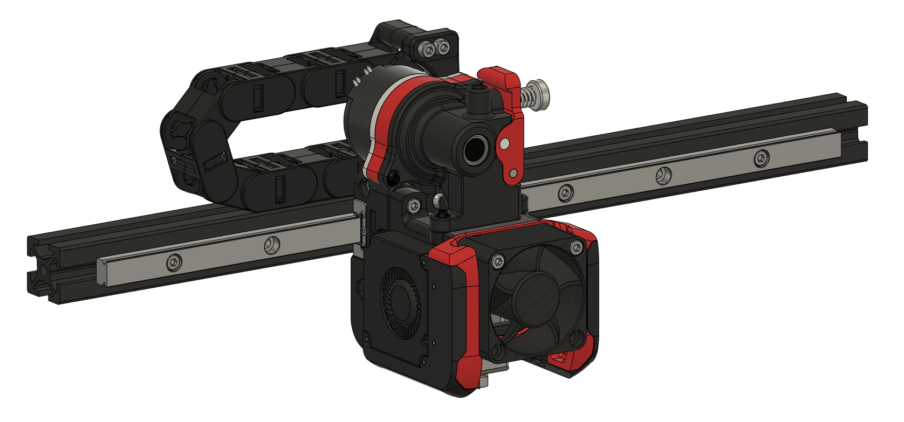

# Galileo Projects
## Projects by JaredC01 using planetary gearsets for the Voron Design printers.

Welcome everyone!

The Galileo project (or more specifically, projects) is designed around a planetary gearset configuration for high-efficiency / low-loss power transfer with gear reductions for increased torque.  The original project started life as a design from lorinczroby on [Thingiverse](https://www.thingiverse.com/thing:4223085), that has been adapted and evolved into what you see here today.  The design has been well-tested, and is not only a very powerful design (with a 7.5:1 gear reduction), but also a very lightweight design, allowing for incredible print speeds over 300mm/s.  The idea of this project was to make a platform that is modular in design, that allows an easy upgrade path from the standard print platforms available to the Voron Design printers.

### Currently, the Voron versions 2.1, 2.2, 1.8, and 2.4 are compatible with the Galileo projects.  Onward to the designs!

## Galileo Extruder

The Galileo Extruder is the least-changed version of the designs, with most of the changes made to the accompanying carriage parts.  The main housing has had quite a few under-the-hood changes made to it in order to make it easier to print, as well as to adapt it to the Voron printhead, but has remained mostly unchanged on the exterior of the design.  The Extruder design REQUIRES a new toolhead, and a new carriage for the X rail.  Currently, there are toolheads for the Slice Engineering Mosquito hot-end, as well as the Triangle Labs Dragon hot-end, and carriages available for the V2.1, and V2.2 printers.  As of now, the V2.1 carriage is limited to the Omron probe (Fotek not currently supported), while the V2.2 carriage is available for both the Fotek probe, as well as the Omron probe.

## Galileo Clockwork

The Galileo Clockwork is a mostly original design based around the Afterburner hot-end system.  This clockwork replaces the existing BMG-style clockwork in order to use the planetary design in its place.  The main parts of the extruder design - the stepper, ring gear housing, planetary gears, and shafts, are all the same from the Extruder to the Clockwork to keep the main "work" portion of the design the same, which allows the parts to be used interchangeably between the designs.  Because this replaced just the clockwork section of the Afterburner configuration, it does not require a new toolhead, fan duct design, etc.  This is a "drop-in" replacement for the clockwork section of the Afterburner.

