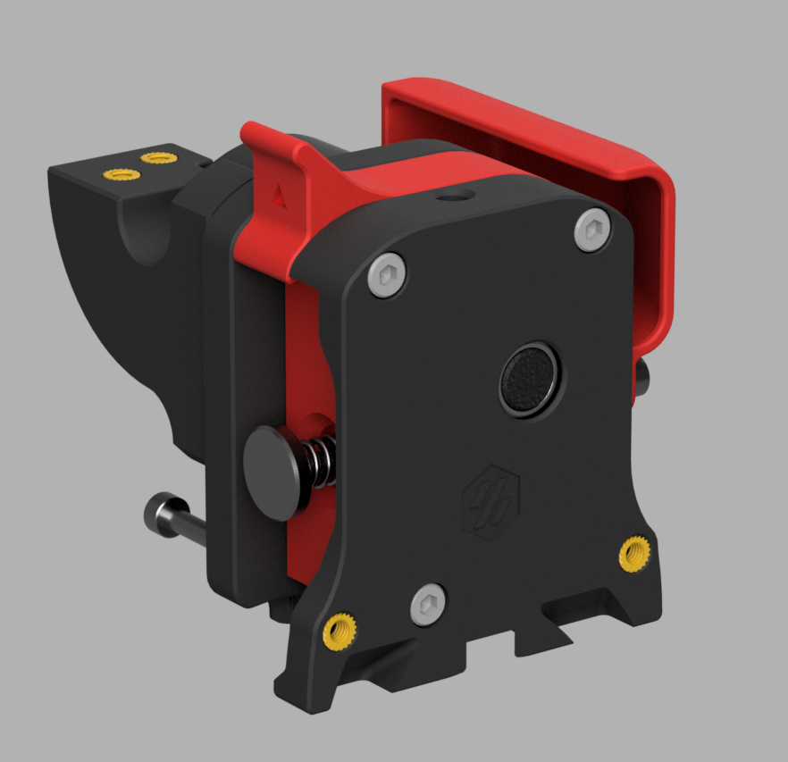
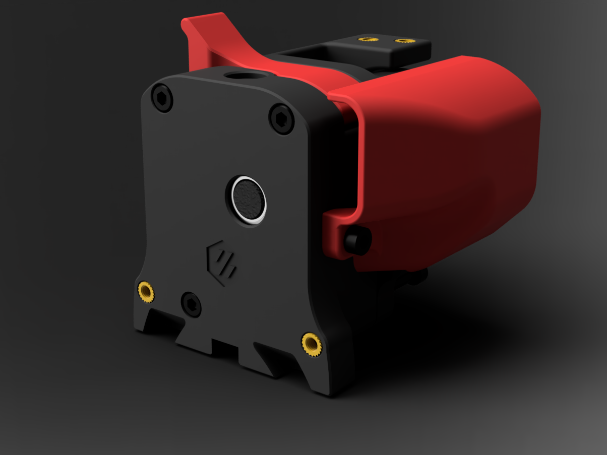
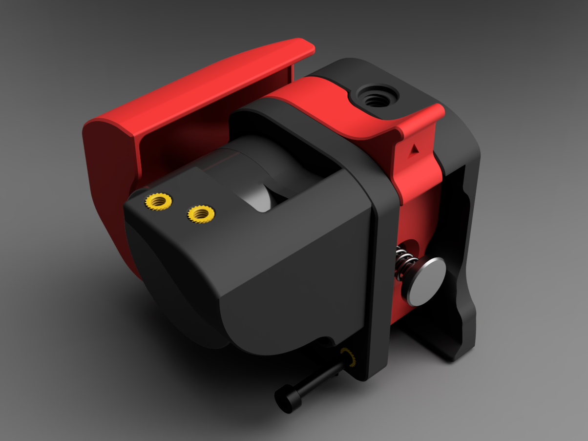

# The Galileo Projects
## Projects by JaredC01 using planetary gearsets for the Voron Design printers.

Welcome everyone!

Here you will find information and files for all of my publicly-available planetary gearset designs, known as the Galileo projects.  All of the Galileo projects have been designed using planetary gearsets for high efficiency gear reduction.

## Galileo Clockwork

### As of now, every Voron running an Afterburner toolhead is compatible with the Galileo Clockwork, however the V1 designs will need a different chain mount design, or an adjusted X/Y Joint on the gantry mount.

#### First, some background, and credit...

The original planetary extruder design was developed by Robert Lorincz and posted on [Thingiverse](https://www.thingiverse.com/thing:4223085) as a project with no name, and titled only by its specs of 140g weight with 10kg of pushing force.  I loved the design so much, I immediately went about adapting it to use with the Voron 2.2 toolhead that I was running at the time.  The Voron project pretty quickly took off, and a name was formed by the Voron community, "The Orbiter".  As it turned out, Robert also loved the name, and adopted it for his model, which is now packaged and sold as the Orbiter (and has become INCREDIBLY popular, for good reason)!  Fast fowarding a bit, I realized that my love of planetary designs was not going to be limited to the extruder design, so I decided to change the project name for my designs to Galileo out of respect for Robert, and to avoid confusion between the models.

The Galileo Clockwork is designed as a drop-in replacement for the existing Afterburner Clockwork module, and uses the same basic core components as the original Orbiter design for the drive system, maintaining a 7.5:1 gear ratio and using the larger Bonctech gears, which allow more grip on the filament.  Robert was also kind enough to allow me to work with LDO to put out a Galileo Clockwork kit, which includes ALL of the necessary core parts, and only requires the printed ABS parts included here for final assembly.

