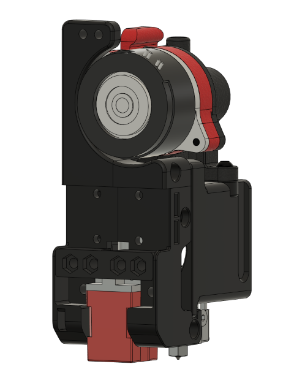

# Galileo Extruder
## Available for the 2.1 and 2.2 Voron Printers.

The Galileo Extruder is a total replacement for the standard / stock Voron 2.1 and 2.2 toolheads, right down to the X Carriage required for mounting.  The design was originally created for the 2.2 toolhead and carriage, and later adapted to work with the 2.1, giving new life to the 2.1 model printer.  Since the 2.1 carriage version was adapted from the newer 2.2 carriage, it updates the 2.1 carriage to be more similar to the 2.2 HD Omron carriage.  This change also unfortunately means that the standard Fotek probe is no longer supported with the 2.1 carriage, and unfortunately this will not be changing.

Onward to the models...

## Voron 2.1
### Omron Carriage

The 2.1 Omron carriage is a fully-redesigned carriage based on the 2.2 HD carriage for the Omron probe.  The carriage is designed for use with either ZipChains from the 2.2 model, or the TapeChains from the stock 2.1 model.  If using the TapeChains, you will need to print the included adapter to allow mounting to the carriage. The STL files are available in the stl folder above, and are listed with "2.1_omron" in the name, as well as "2.1_tape_chain" for the TapeChain adapter.

## Voron 2.2 Carriage
### Omron Carriage

The 2.2 Omron Carriage is a modified version of the HD carriage originally created by the Voron development team.  It is ONLY compatible with the Omron probe, which mounts sideways in the carriage.  The STL files are available in the stl folder above, and are listed with "2.2_hd_omron" in the name.

### Fotek Carriage

The 2.2 Fotek Carriage is a modified version of the standard carriage originally created by the Voron development team.  It is ONLY compatible with the Fotek probe, which mounts front-to-back.  There are additional files required for mounting the 2.2 Fotek Carriage, which can be found in the stock Voron 2.2 GitHub. The STL files are available in the stl folder above, and are listed with "2.2_fotek" in the name.